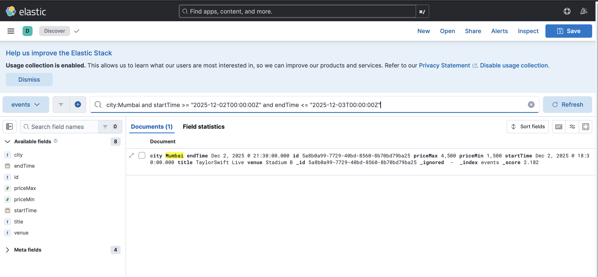

# ticketmaster-clone
Distributed Ticket Booking System (TicketMaster-like backend) – Built to explore distributed systems concepts: high-concurrency seat reservations, idempotent payments, event-driven workflows, Redis locks, Elasticsearch search, and real-time seat updates with SSE/Kafka.
<p align="center">  </p>

### Core Components
1. API Gateway (/gateway/gateway-service)
   The entry point for all client requests, responsible for security and traffic control.

        Routing: Routes traffic to the appropriate downstream service.
        Security: Handles optional JWT authentication.
        Observability: Adds request-specific Correlation IDs for distributed tracing.
        Rate Limiting: Implements Token Bucket algorithm for request throttling, backed by Redis for centralized counting.

2.  Event Service (/services/event-service) - Port :8081
    The system of record for event data.

        CRUD: Manages all event data persisted in PostgreSQL 16.
        Data Consistency: Uses the Transactional Outbox Pattern to ensure event data changes are published reliably.
        Search Integration: Implements an in-app relay to forward events from the Outbox table to be indexed by the Search Service in Elasticsearch.

3. Search Service (/services/search-service) - Port :8083
       Provides fast, flexible, and scalable search functionality.

       Query Engine: Executes complex search operations against Elasticsearch 8.15.x.
       Features: Supports full-text search, filtering, sorting, and pagination across all indexed events.
4. Booking Service (/services/booking-service) - Port :8082
   Handles the high-concurrency seat reservation and booking process.

       Concurrency Control: Uses Redis Lua Scripts to implement atomic, distributed seat locks for holding tickets before purchase confirmation.

       Real-time Updates: Provides a real-time Server-Sent Events (SSE) stream to clients for immediate updates on seat availability (seating snapshots).

       Persistence: Confirmed bookings are finalized and stored in PostgreSQL.

### Infrastructure
| Component | Technology | Purpose | 
| :--- | :--- | :--- | 
| **Primary Data** | PostgreSQL 16 | System of Record for Events and Bookings. | 
| **Concurrency/Caching** | Redis 7 | Distributed lock manager (Lua scripting) and rate limit token storage. | 
| **Search Engine** | Elasticsearch 8.15.x | High-speed, indexed full-text search and filtering. | 
| **Monitoring (Optional)** | Kibana | User interface for monitoring and querying Elasticsearch data. |


**Default ports**

- API Gateway: `:8080` (routes to downstreams)
- Event Service: `:8081`
- Booking Service: `:8082`
- Search Service: `:8083` (configurable)
- Postgres: `:5432`
- Redis: `:6380` (mapped to container `6379`)
- Elasticsearch: `:9200` (HTTP)

---

## How It Works (End-to-End)

1. **Clients** call **Gateway**. Requests are authenticated (JWT), traced (Correlation-Id), **rate-limited** (Redis token-bucket), and routed to services.
2. **Event Service** persists events in **Postgres**. In the **same DB transaction**, it appends a row to the **`outbox_events`** table (JSON payload that mirrors the ES document).
3. A tiny **In-App Relay** polls `outbox_events` using `FOR UPDATE SKIP LOCKED`, pushes to **Elasticsearch**, and updates status with **retries/backoff**.
4. **Search Service** serves queries from ES (full-text + filters + sort/paging).
5. **Booking Service** uses **Redis Lua** scripts to atomically **hold seats** (short TTL), confirms bookings into Postgres, and broadcasts **SSE** messages so all connected UIs see live seat changes.

---

## API Gateway: Token Bucket Rate Limiting

Spring Cloud Gateway uses `RequestRateLimiter` with `RedisRateLimiter` (a **token-bucket**):
- **replenishRate**: tokens added per second,
- **burstCapacity**: bucket size (allows short bursts),
- **userKeyResolver**: per-user key (falls back to client IP).

```yaml
# gateway-service/src/main/resources/application.yml
spring:
  cloud:
    gateway:
      routes:
        - id: booking
          uri: http://booking-service:8082
          predicates: [ Path=/bookings/**, /sse/** ]
          filters:
            - RequestRateLimiter=
                key-resolver: "#{@userKeyResolver}"
                redis-rate-limiter.replenishRate: 10
                redis-rate-limiter.burstCapacity: 20
```
KeyResolverConfig:

Uses X-User-Id (or JWT subject) if present,

Else falls back to exchange.getRequest().getRemoteAddress().

This is token-bucket semantics: each request consumes a token; tokens refill at replenishRate; overflow allowed up to burstCapacity.

### CDC: Transactional Outbox + In-App Relay → Elasticsearch


## Directory Layout
```
├── deploy/ # docker-compose for infra
├── docs/
│ ├── design.excalidraw # editable
│ └── architecture.png # exported PNG (used in README)
├── gateway/gateway-service # Spring Cloud Gateway
├── libs/ # shared libs (common models, outbox, etc.)
├── services/
│ ├── event-service # events + outbox + ES relay
│ ├── booking-service # holds + bookings + SSE
│ └── search-service # ES search API
├── build.gradle.kts # root build (aggregates)
└── settings.gradle
```

## Prereqs

- Java 17+
- Gradle (wrapper included)
- Docker + Docker Compose
- cURL or Postman
- (Optional) Kibana

---

## Quick Start

### 1) Spin up infra

```bash
cd deploy
docker compose up -d postgres redis elasticsearch  # add kibana if you want
```

## From repo root
./gradlew clean build

## Event Service (8081)
cd services/event-service && ./gradlew bootRun

## Booking Service (8082)
cd ../booking-service && ./gradlew bootRun

## Search Service (8083)
cd ../search-service && ./gradlew bootRun

## Gateway (8080)
cd ../../gateway/gateway-service && ./gradlew bootRun

## Booking Experience like this

<p align="center">  </p>

## Application Demonstration
Elasticsearch for search service
<p align="center">  </p>
Create event with create service
<p align="center">  </p>
SSE Api
<p align="center">  </p>
Hold ticket Api
<p align="center">  </p>
Hold ticket SSE Reflectiion
<p align="center">  </p>
Confirm Ticket Api
<p align="center">  </p>
Confirm ticket SSE Reflectiion
<p align="center">  </p>
Snapshot Api for initial booking status
<p align="center">  </p>

